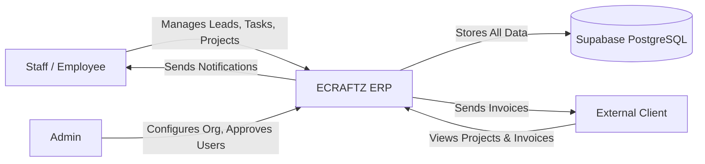
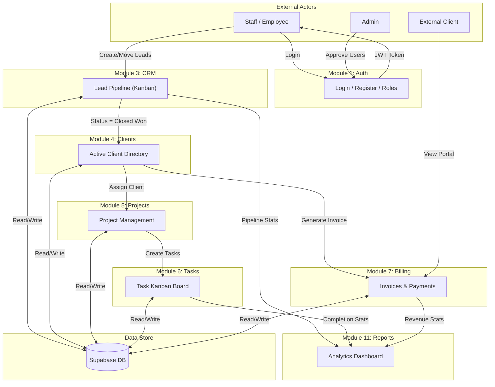
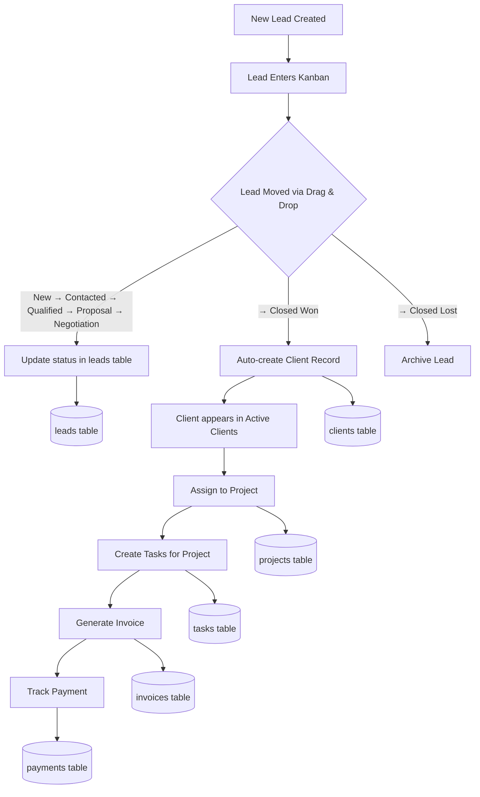
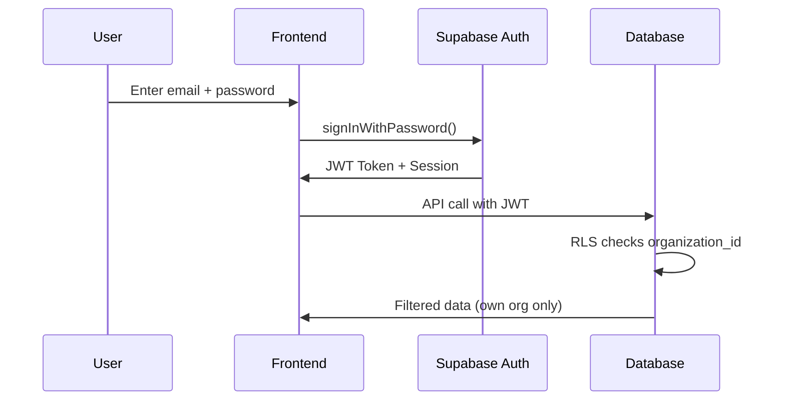

# ECRAFTZ ERP & CRM — Complete System Documentation
### Version 1.0 | Prepared by: Development Team | Date: May 2026

---

## 1. Project Overview

**ECRAFTZ** is a multi-tenant Enterprise Resource Planning (ERP) and Customer Relationship Management (CRM) web platform. It is designed to manage the complete lifecycle of a business — from acquiring a new lead, converting them into an active client, managing projects and tasks for that client, issuing invoices, and tracking payments.

**Key Highlights:**
- Multi-tenant architecture (data isolation per organization)
- Role-based access control (Admin, Manager, Employee, Client)
- Real-time notifications and activity feeds
- Responsive, modern UI with dark-mode interface

---

## 2. Technology Stack

| Layer            | Technology                      |
|------------------|---------------------------------|
| Frontend         | React 18 (Vite Build Tool)      |
| Language         | TypeScript                      |
| Styling          | Tailwind CSS + Shadcn UI        |
| State Management | Zustand                         |
| Backend/Database | Supabase (PostgreSQL)           |
| Authentication   | Supabase Auth (JWT)             |
| Security         | Row Level Security (RLS)        |
| Charts           | Recharts                        |
| Drag & Drop      | @dnd-kit                        |
| Icons            | Lucide React                    |
| Routing          | React Router v6                 |

---

## 3. System Modules

The system is organized into **13 functional modules**, each responsible for a specific business domain.

---

### Module 1: Authentication & Identity Management
**Route:** `/login`, `/register`  
**Files:** `LoginPage.tsx`, `RegisterPage.tsx`, `ProtectedRoute.tsx`

**Features:**
- User registration with email and password
- Secure login with JWT-based sessions
- Protected route guards (unauthenticated users are redirected to login)
- Role-based route protection (Admin, Manager, Employee)
- Auto-assignment of `employee` role on registration with `pending` status
- Admin-gated approval workflow (new users must be approved before accessing the system)

---

### Module 2: Dashboard (Executive Overview)
**Route:** `/`  
**Files:** `Dashboard.tsx`

**Features:**
- KPI summary cards: Total Revenue, Active Projects, Open Tasks, Team Members
- Revenue trend chart (Recharts area chart with date filtering)
- Date range filter (last 7 days, 30 days, custom range)
- Recent activity feed (real-time via Supabase subscriptions)
- Quick-action buttons for creating tasks, projects, and invoices
- Lead pipeline summary (counts per stage)
- Overdue tasks and upcoming deadlines

---

### Module 3: CRM — Lead Management
**Route:** `/crm`  
**Files:** `CRMPage.tsx`, `LeadKanban.tsx`, `LeadKanbanColumn.tsx`, `LeadKanbanCard.tsx`, `LeadForm.tsx`, `LeadDetails.tsx`, `LeadList.tsx`

**Features:**
- **Kanban Board** with 7 stages: New → Contacted → Qualified → Proposal → Negotiation → Closed Won → Closed Lost
- Drag-and-drop lead movement between stages (powered by @dnd-kit)
- Local-first optimistic UI (instant card movement, no server lag)
- Lead creation form (first name, last name, email, phone, company, value, source, segment)
- Lead detail view with full edit capability
- Lead scoring (0–100 scale)
- Segment filtering (Hot, Warm, Cold, General)
- Search by name or company
- **Self-healing promotion**: Virtual leads (from clients) are automatically promoted to real database records when moved
- Two-way name synchronization between leads and clients
- List view toggle (table format)

---

### Module 4: Client Lifecycle Management
**Route:** `/clients`  
**Files:** `ClientsPage.tsx`, `ClientList.tsx`, `ClientForm.tsx`

**Features:**
- Active clients directory
- Add, edit, and delete clients
- Client form: name, email, phone, address, website, service, contract value
- **Smart filtering**: Only clients linked to "Closed Won" leads appear in Active Clients
- Automatic client promotion: When a lead reaches "Closed Won", they appear here
- Automatic hiding: Moving a lead OUT of "Closed Won" removes them from Active Clients
- Real-time name sync with CRM leads

---

### Module 5: Project Management
**Route:** `/projects`, `/projects/:id`  
**Files:** `ProjectsPage.tsx`, `ProjectDetailPage.tsx`, `ProjectForm.tsx`, `ProjectCard.tsx`, `MilestoneForm.tsx`

**Features:**
- Project creation with: name, type, description, client assignment, status, start/end dates, budget
- Project statuses: Planning, In Progress, On Hold, Completed, Cancelled
- Project detail page with milestones
- Milestone tracking (title, description, due date, completion status)
- Team member assignment to projects
- Project card view with status indicators
- Client-linked projects (assign projects to specific clients)
- Budget tracking

---

### Module 6: Task Management
**Route:** `/tasks`  
**Files:** `TasksPage.tsx`, `KanbanBoard.tsx`, `KanbanColumn.tsx`, `TaskCard.tsx`, `TaskForm.tsx`, `TaskDetailsDialog.tsx`, `TaskList.tsx`

**Features:**
- **Kanban Board** with 4 columns: To Do → In Progress → Review → Done
- Drag-and-drop task movement
- Task creation: title, description, priority, status, assigned user, due date, project link
- Priority levels: Low, Medium, High, Urgent
- Task detail dialog with full editing
- Subtask management within each task
- Task comments/discussion thread
- Assignee management (assign tasks to team members)
- List view toggle (table format with sorting)
- Filter by project, assignee, and priority

---

### Module 7: Billing & Invoicing
**Route:** `/billing`, `/billing/:id`  
**Files:** `BillingPage.tsx`, `InvoiceDetail.tsx`, `InvoiceForm.tsx`, `InvoiceList.tsx`, `ProfessionalInvoice.tsx`

**Features:**
- Invoice creation: client selection, amount, tax rate, due date, line items
- Invoice statuses: Draft, Sent, Paid, Overdue, Cancelled
- Auto-generated unique invoice numbers
- Tax calculation (configurable tax rate and amount)
- Professional invoice template (printable/PDF-ready)
- Invoice detail view
- Invoice list with filters
- Recurring invoice support
- Payment tracking linked to invoices
- Revenue analytics

---

### Module 8: HR & People Management
**Route:** `/hr`  
**Files:** `HRDashboard.tsx`, `EmployeeDirectory.tsx`, `EmployeeForm.tsx`, `AttendanceLeave.tsx`, `LeaveRequestForm.tsx`, `PayrollSystem.tsx`

**Features:**
- HR Dashboard with workforce overview
- Employee directory (list of all team members)
- Employee onboarding form
- Attendance and leave management
- Leave request submission and approval workflow
- Payroll system (salary tracking and calculations)
- Department and role management

---

### Module 9: Time Tracking
**Route:** `/time-tracking`  
**Files:** `TimeTrackingPage.tsx`, `timeStore.ts`

**Features:**
- Log work hours against tasks and projects
- Time entries with date, hours, and description
- Timesheet overview
- Integration with Dashboard KPI (total hours logged)

---

### Module 10: Support & Ticketing
**Route:** `/support`, `/support/tickets/:id`  
**Files:** `SupportDashboard.tsx`, `TicketDetailPage.tsx`, `KnowledgeBasePage.tsx`

**Features:**
- Support ticket creation and management
- Ticket detail view with conversation thread
- Ticket status tracking (Open, In Progress, Resolved, Closed)
- Priority assignment
- Knowledge base for self-service articles
- Internal support dashboard

---

### Module 11: Reports & Analytics
**Route:** `/reports` (Admin/Manager only)  
**Files:** `ReportsPage.tsx`, `activityStore.ts`

**Features:**
- Comprehensive reports dashboard
- Lead conversion analytics
- Revenue reports
- Task completion metrics
- Team performance overview
- Activity log with real-time updates (Supabase realtime subscriptions)
- Role-restricted access (Manager and Admin only)

---

### Module 12: Notifications
**Route:** `/notifications`  
**Files:** `NotificationsPage.tsx`, `notificationsStore.ts`

**Features:**
- In-app notification center
- Read/unread notification management
- Notification types: Info, Warning, Action Required
- Clickable links to navigate to related items
- Real-time notification delivery

---

### Module 13: Admin & Settings
**Route:** `/settings` (Admin only), `/teams`, `/profile`  
**Files:** `SettingsPage.tsx`, `TeamPage.tsx`, `ProfilePage.tsx`, `TeamList.tsx`

**Features:**
- **Organization Settings**: Company name, tax ID, corporate email, website, logo, address, phone
- **Team Management**: Invite, approve, and manage team members
- Role assignment (Admin, Manager, Employee)
- User approval/rejection workflow (pending users must be approved by admin)
- **Profile Page**: Personal profile editing (name, avatar, email)
- Admin-only access control

---

### Module 14: Client Portal (External)
**Route:** `/portal`, `/portal/projects`, `/portal/invoices`  
**Files:** `ClientDashboard.tsx`, `ClientProjects.tsx`, `ClientInvoices.tsx`, `ClientLayout`

**Features:**
- Separate portal for external clients
- Client dashboard with project overview
- View assigned projects and their status
- View and download invoices
- Isolated layout (different UI from internal staff)

---

## 4. Data Flow Diagram (DFD)

### Level 0 — Context Diagram
Shows the system as a single process with external entities.



### Level 1 — Module Interaction DFD
Shows how data flows between the core modules.



### Level 2 — CRM Lead Lifecycle (Detailed)
Shows the internal data flow of the lead-to-client conversion process.



---

## 5. Database Schema Summary

| Table                  | Purpose                                    | Key Columns                              |
|------------------------|--------------------------------------------|------------------------------------------|
| `profiles`             | User accounts & roles                      | id, full_name, email, role, organization_id |
| `organization_settings`| Company configuration                      | company_name, tax_id, logo_url           |
| `leads`                | Sales pipeline prospects                   | first_name, status, value, assigned_to   |
| `clients`              | Active business relationships              | name, email, lead_id, contract_value     |
| `projects`             | Work engagements for clients               | name, client_id, status, budget          |
| `project_members`      | Team assignment to projects                | project_id, user_id, role                |
| `project_milestones`   | Project phase tracking                     | project_id, title, due_date, is_completed|
| `tasks`                | Individual work items                      | title, project_id, assigned_to, priority |
| `subtasks`             | Checklist items within tasks               | task_id, title, is_completed             |
| `task_comments`        | Discussion threads on tasks                | task_id, content, user_id                |
| `proposals`            | Business proposals for leads/clients       | lead_id, title, amount, status           |
| `invoices`             | Financial billing documents                | client_id, amount, status, due_date      |
| `payments`             | Payment records against invoices           | invoice_id, amount, payment_method       |
| `subscriptions`        | Recurring billing agreements               | client_id, amount, frequency             |
| `notifications`        | In-app user notifications                  | user_id, title, message, is_read         |
| `activities`           | System-wide audit log                      | action, target_type, target_name         |

---

## 6. Security Architecture

### Multi-Tenancy
- Every table contains an `organization_id` column
- A PostgreSQL helper function `get_my_org_id()` extracts the current user's organization
- Row Level Security (RLS) policies enforce: **Users can only access data belonging to their own organization**

### Role-Based Access Control (RBAC)
| Role     | Access Level                                                  |
|----------|---------------------------------------------------------------|
| Admin    | Full access: Settings, Team Management, Reports, all modules  |
| Manager  | Reports access + all standard modules                         |
| Employee | Standard modules: CRM, Tasks, Projects, Billing, HR          |
| Client   | Client Portal only: View projects and invoices                |

### Authentication Flow


---

## 7. Application Route Map

| Route                    | Module          | Access       | Description                    |
|--------------------------|-----------------|--------------|--------------------------------|
| `/login`                 | Auth            | Public       | User login page                |
| `/register`              | Auth            | Public       | New user registration          |
| `/`                      | Dashboard       | All Staff    | Executive overview             |
| `/crm`                   | CRM             | All Staff    | Lead pipeline Kanban           |
| `/clients`               | Clients         | All Staff    | Active clients directory       |
| `/projects`              | Projects        | All Staff    | Project listing                |
| `/projects/:id`          | Projects        | All Staff    | Project detail & milestones    |
| `/tasks`                 | Tasks           | All Staff    | Task Kanban & list             |
| `/billing`               | Billing         | All Staff    | Invoice management             |
| `/billing/:id`           | Billing         | All Staff    | Invoice detail view            |
| `/hr`                    | HR              | All Staff    | HR dashboard                   |
| `/time-tracking`         | Time Tracking   | All Staff    | Work hours logging             |
| `/support`               | Support         | All Staff    | Support tickets                |
| `/support/tickets/:id`   | Support         | All Staff    | Ticket detail                  |
| `/teams`                 | Admin           | All Staff    | Team directory                 |
| `/profile`               | Admin           | All Staff    | Personal profile               |
| `/notifications`         | Notifications   | All Staff    | Notification center            |
| `/reports`               | Reports         | Manager+     | Analytics & reports            |
| `/settings`              | Admin           | Admin Only   | Organization settings          |
| `/portal`                | Client Portal   | Clients      | Client dashboard               |
| `/portal/projects`       | Client Portal   | Clients      | Client project view            |
| `/portal/invoices`       | Client Portal   | Clients      | Client invoice view            |

---

## 8. Key Business Workflows

### Workflow 1: Lead-to-Revenue Pipeline
```
New Lead → Contact → Qualify → Propose → Negotiate → Win → Create Client → Assign Project → Create Tasks → Generate Invoice → Receive Payment
```

### Workflow 2: Employee Onboarding
```
User Registers → Status = "Pending" → Admin Approves → Status = "Approved" → User Gets Access
```

### Workflow 3: Project Delivery
```
Create Project → Set Milestones → Assign Team Members → Create Tasks → Track Progress → Mark Milestones Complete → Close Project
```

---

*Document generated for ECRAFTZ ERP & CRM System — Confidential*
