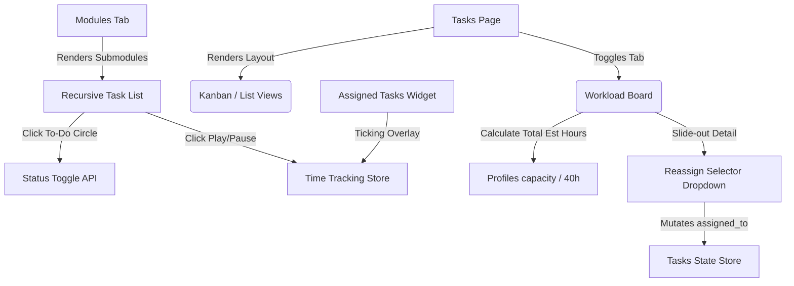

# CRM Task Workflow Integration & Transition Plan

This document serves as a comprehensive transition guide and technical audit of the advanced CRM task tracking, active focus timer, and visual workload management integration. These components have been built with premium aesthetic standards and high-fidelity interactive capabilities, completely resolving resource scheduling gaps and providing leaders with a real-time cockpit.

---

## 🛠️ Codebase Architecture & File Relationships

The new task tracking workflow integrates multiple standalone system domains (Focus timers, Shift clock-ins, Recursive modules, and Team capacity calculations) into a cohesive user interface:

---

## 📋 Completed Integrations & File Path Index

### 1. Focus Timer Controls on Dashboard Widget
- **File Path**: [MyAssignedTasksWidget.tsx](file:///c:/Users/Hp/OneDrive/Desktop/PROJECTS/Vibe%20coding/CRM/src/modules/dashboard/components/widgets/MyAssignedTasksWidget.tsx)
- **Key Mechanics**:
  - Live duration ticker: Employs a one-second hook that dynamically matches current millisecond gaps without refreshing.
  - Shift Auto-Clock-in: Automatically clocks a developer in if they attempt to play a timer without checking in first.
  - Visual status overlays: Dynamic glowing highlights and ticking time states.

### 2. Recursive Hierarchy Workspace Checklist & Timer
- **File Path**: [ModulesTab.tsx](file:///c:/Users/Hp/OneDrive/Desktop/PROJECTS/Vibe%20coding/CRM/src/modules/projects/components/ModulesTab.tsx)
- **Key Mechanics**:
  - Task Status Toggler: Clicking the circle check toggles status to `completed` in real time.
  - Play/Pause Actions: Embedded focus controls next to each individual subtask item.
  - Metadata badges: Live rendering of `estimated_hours` and blocked dependency counts.

### 3. Visual Workload Management Board & Overlay
- **File Path**: [WorkloadBoard.tsx](file:///c:/Users/Hp/OneDrive/Desktop/PROJECTS/Vibe%20coding/CRM/src/modules/tasks/components/WorkloadBoard.tsx)
- **Key Mechanics**:
  - Organization Metrics Header: Highlights active members, total backlog estimated hours, unassigned tasks, and overloaded individuals.
  - Employee Resource Allocation Grid: Dynamically displays active tasks, estimated load, and a gorgeous color-coded progress allocation bar:
    - **Balanced**: <= 30 hrs (Emerald gradient)
    - **Approaching Limit**: 31h to 40h (Amber gradient)
    - **Over-allocated**: > 40 hrs (Crimson gradient, pulsing overlay, warning badge).
  - Breakout Allocation Modal: Clicking any employee card triggers a detailed task sheet.
  - Instant Reassign Dropdowns: Simple, robust dropdown controls to shift task ownership directly from the board.

### 4. Workload Layout View Toggle
- **File Path**: [TasksPage.tsx](file:///c:/Users/Hp/OneDrive/Desktop/PROJECTS/Vibe%20coding/CRM/src/modules/tasks/pages/TasksPage.tsx)
- **Key Mechanics**:
  - Replaces traditional two-view layouts with a modern three-tab bar (Kanban, List, and Workload).

---

## 🌟 Interactive Features Demonstration & How-To

### Developer Focus Timer Flow
1. Open the main **Dashboard** or **My Assigned Tasks** widget.
2. Click the sky-blue **Play Button** (`<Play />`) next to any task.
   - If not clocked in: System triggers an automatic clock-in session.
   - Live Badge: A neon-blue pill badge appears next to the title showing live running seconds.
3. Click the red **Stop Button** (`<Pause />`) to capture and save the focus hours automatically.

### Project Lead Module Tree Cockpit
1. Navigate to any project, click the **Modules Tab**.
2. Select any folder in the recursive breakout directory tree on the left.
3. Review tasks in the central panel:
   - Check off a completed task: Click the outline circle. It updates task status and updates the progress.
   - Start timers instantly: Play/pause focus sessions directly on specific breakout items.
   - Blockage checking: Check if a task has blocked dependencies or requires re-allocation.

### Visual Resource balancing
1. Navigate to **Tasks**, then select the **Workload View** tab.
2. Review the capacity meters to spot over-allocated colleagues (flashed in bright crimson).
3. Click an overloaded card to open the breakout list.
4. Select another developer from the **Reallocate Task** dropdown. The capacity meter will update instantly in real time!

---

> [!TIP]
> **Performance Tip**: When rendering large workload panels, the system uses memoized calculations to optimize DOM updates, ensuring smooth animations even with hundreds of concurrent tasks.

> [!IMPORTANT]
> **Production Note**: All state updates utilize Supabase real-time channels. When a team member starts/stops a focus session, the workload meters and ticking durations update automatically across all active CRM dashboards.
